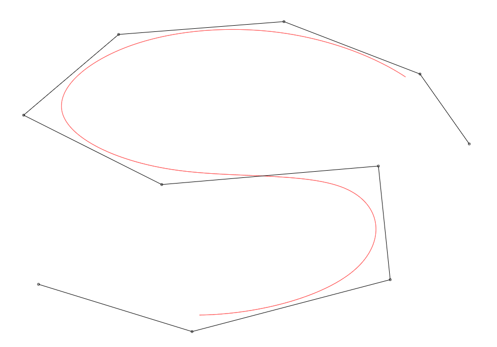
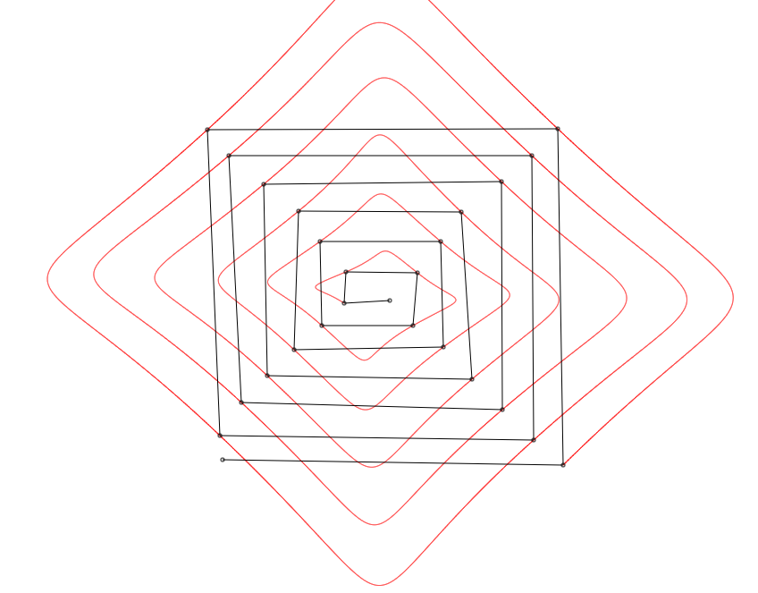
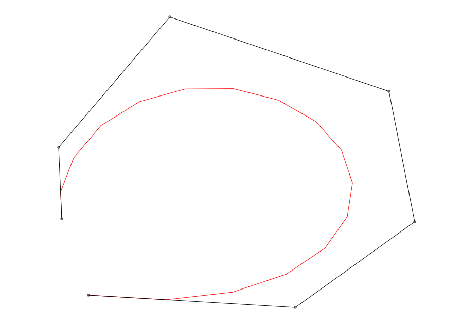
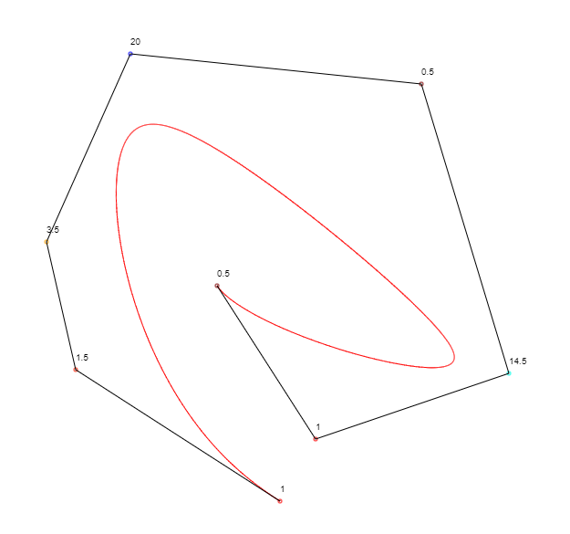

# splines

A Kotlin/JS + React web application to draw various splines and curves
on a HTML canvas. Allows the user to add or remove points using mouse
presses and change point weight on some curve types using scroll wheel.

I developed this application to study for exams for my Geometric Modelling course,
but the code might be interesting to others.
I tried my best to document all the math used in the code.

Based on the Kotlin "full stack web application" template and hence comes with a Ktor server.

## Screenshots

### Cubic Bezier Spline

### Cubic Cardinal Spline

### Degree Elevation (x10)

### Rational Bezier Curve

## Supported Curve/Spline Types

* Bezier Curve (via De Casteljau's Algorithm)
* Bezier Curve (via Bernstein polynomials)
* Bezier Curve via degree elevation - variants for 1,2,5,10,100,1000 times
* Quadratic Spline (via Bezier curve segments)
* Cubic Spline (via Bezier curve segments)
* Rational Bezier Curve
* Quadratic Rational B-Spline (uniformly spaced knots)
* Cubic Rational B-Spline (uniformly spaced knots)
* Cubic Cardinal Spline (uniformly spaced knots) - variants for various tension values

Most spline types are displayed by evaluating a function at small increments of t (usually 1/1000),
and does so twice for the x and y coordinates.

Some splines will show up with as little as two points (as a straight line
between them) but others will require 3-4 points to be displayed.

## How to use

* Use the radio buttons at the bottom to change the spline type
* Left click to add a control point
* Right click to remove a control point
* For Rational Bezier Curve and Rational B-Splines, use the scroll wheel to change the weight of a control point